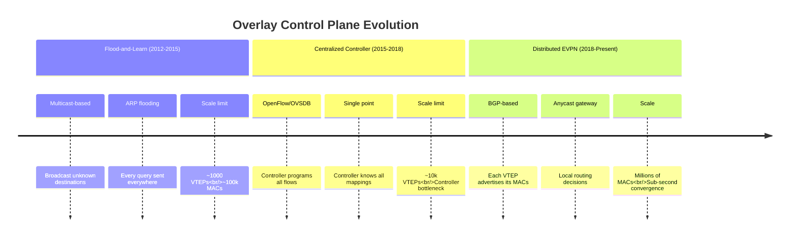

# The Matryoshka Dolls of Modern Networking: A Technical Evolution

## Introduction: The Layered Illusion of Connectivity

The history of modern networking is, fundamentally, a history of virtualization—a relentless pursuit to decouple logical intent from physical constraint. This evolution is frequently and aptly analogized to the "Matryoshka doll," the Russian nesting doll where layers of concealment hide the core reality. In hyperscale data centers and cloud-native environments, these dolls represent layers of packet encapsulation: protocols wrapped inside protocols to create the illusion of infinite, flat, and secure connectivity over infrastructure that is physically hierarchical, constrained, and inherently insecure.

Today we'll trace this evolution through the pivotal architectural shifts made by industry titans—including AOL, eBay, Amazon, Google, Facebook (Meta), Spotify, and AT&T—from the rigid, manual provisioning of the early internet to the hyper-programmable, kernel-bypass architectures of the present day.

---

## Part 1: Why Overlays Became Inevitable - The Breaking Point

### The $500,000 Rack Rewire Problem

In the early 2000s, as VMware was transforming enterprise IT, a major bank faced a crisis that perfectly illustrates why overlays became essential. They'd virtualized 80% of their servers but hit a wall:

**The Physical Constraint:** Their network was literal. A server's IP address was a direct map to its physical location—a specific rack, in a specific row, connected to a specific port on a switch. The "control plane" for these massive networks was often a **static spreadsheet manually updated by network engineers**.

**The Business Impact:** Every time application teams needed VMs to communicate across different racks, network engineers had to physically rewire switches. This took days, cost thousands in overtime, and created deployment bottlenecks. When two banks merged in 2009, they spent **6 months re-IPing thousands of servers at a cost of $2M+** because both used the same IP ranges (10.0.0.0/8).

### The Technical Limit: VLAN Exhaustion

The IEEE 802.1Q VLAN standard has a 12-bit identifier limit - only 4,094 logical segments. For cloud providers or massive enterprises like eBay or global banks, this ceiling was catastrophically low:

```python
# The mathematical impossibility of traditional networking
max_vlans = 4094
cloud_tenants_needed = 1000000  # 1 million customers
coverage = (max_vlans / cloud_tenants_needed) * 100
print(f"VLAN coverage: {coverage:.2f}%")  # 0.41% - Not even close!
```


**The Wake-Up Call:** Amazon's 2010 Black Friday crash demonstrated that scaling up—buying bigger load balancers and routers—was a dead end. The network needed to scale out, just like the compute layer.

---

## Part 2: Today's World - Real Systems Using Overlays Right Now

### Kubernetes: The Overlay Orchestrator

**Spotify's Migration - A Case Study in Optimization:**

When Spotify migrated to Kubernetes, they faced the "Double Matryoshka" problem:

1. **Container Overlay:** The CNI (Flannel VXLAN) encapsulates container packets
2. **Cloud Overlay:** AWS VPC fabric encapsulates those packets again

This double-encapsulation, combined with iptables for service routing (kube-proxy), created massive performance penalties. Spotify's adoption of **Cilium with eBPF** allowed them to bypass this inefficiency through "Direct Routing" modes, stripping away the inner encapsulation layer. The results were dramatic:

- **2-3x improvement in CPU utilization** across their fleet
- **40% reduction in network overhead**
- Elimination of "hairpinning" where packets traverse the TCP/IP stack multiple times

### AWS Nitro System: Hardware-Accelerated Overlays

While Spotify solved networking challenges with software, Amazon Web Services took a hardware-centric approach with the **AWS Nitro System**:

**How It Works:** The Nitro physically separates virtualization functions from the customer's main board. A dedicated hardware card handles VPC networking, EBS storage, and instance security.

**The Impact:** The "cost" of the Matryoshka doll—the CPU cycles needed to encapsulate packets—is offloaded to an ASIC. Customers get "bare metal" performance because their CPU is no longer burdened with the hypervisor's networking logic.

**AWS's Shift to Geneve:** AWS moved from VXLAN to **Geneve (Generic Network Virtualization Encapsulation)** because VXLAN lacked flexibility for modern requirements. Geneve's TLV (Type-Length-Value) headers allow AWS to inject metadata such as:

- GWLBE ID (identifying specific endpoints)
- Flow Cookies (for session stickiness)
- Security context and routing instructions

### Financial Sector: JP Morgan and Deterministic Overlays

JP Morgan Chase's trading network illustrates how hyperscale technologies are adapted for highly regulated enterprise environments:

**Requirements:**

- Latency: <100 microseconds between trading servers
- Scale: 50,000+ servers globally
- Isolation: 5000+ separate trading environments

**Solution:** EVPN-VXLAN Fabric with Arista 7280R3 switches

- Control Plane: EVPN with BGP
- Data Plane: VXLAN with hardware offload
- **Results:** Consistent 50μs latency, zero-touch provisioning, 99.999% uptime over 3 years

---

## Part 3: The Evolution - From Spreadsheets to Smart Overlays

### Era 1: Physical Rigidity (1995–2010) - "The Single Doll"

**AOL's Spreadsheet Control Plane:** Network engineering was less about software orchestration and more about physical inventory management. The "control plane" was often a static spreadsheet manually updated by network engineers.

**The "Bank Rack" Phenomenon:** When virtualization hit financial institutions, it created a "split-brain" scenario. Server teams managed virtual switches (vSwitches) while network teams managed physical switches (ToR). This disconnect led to severe instability - VMs would lose connectivity after migration because physical network infrastructure failed to update ARP tables correctly.


_Total Overhead: 18 bytes minimum(Ethernet + VLAN), Total Bytes: 144 bits minimum overhead_

### Era 2: Virtualization Explosion (2010–2015) - "The Dual Doll"

**eBay's VXLAN Industrialization (2014):** eBay deployed OpenStack and VXLAN at massive scale to break the 4,096 VLAN limit. VXLAN's 24-bit VNI expanded the addressable space to 16 million logical networks.

**The Mechanism:**

```yaml
Physical Reality: eBay had 8,000+ physical servers running 100,000+ VMs
Problem: Needed 5000+ VLANs (exceeded 4094 limit)
Workaround: Multiple parallel networks (cost: $5M+)

Solution: Single VXLAN fabric with 8000+ VTEPs
Result: ~3000 VNIs used, $3M/year savings in switch costs
```

**Google's GRE Struggle:** Google relied heavily on GRE, which introduced the **MTU and Fragmentation Crisis**. GRE adds 24 bytes of overhead, pushing standard 1500-byte packets to 1524 bytes. When the physical network's MTU was 1500, packets fragmented, causing massive latency spikes.


### Era 3: The Matryoshka Crisis (2015–2018) - Double Encapsulation

**The Spotify Problem:** When running Kubernetes on AWS, a "Double Matryoshka" emerged:

1. Container overlay (Flannel VXLAN) encapsulates container packets
2. Cloud overlay (AWS VPC) encapsulates those packets again

**Validated Impact:** While pure packet processing overhead is 5-15%, broader operational overhead including context switches and sidecar proxies reached **upwards of 40%**.


### Era 4: Smart Overlays (2018–Present) - Paying Down Technical Debt

**Facebook's Katran:** Facebook developed Katran, a Layer 4 load balancer using eBPF and XDP (eXpress Data Path). By processing packets at the earliest possible point in the driver—before the kernel stack engages—they achieved:

- **10x performance improvement** vs standard kernel solutions
- **Linear scaling** with NIC receive queues
- Ability for a single server to handle **millions of packets per second**

**DoorDash's eBPF Monitoring:** Faced with traditional monitoring limitations, DoorDash developed BPFAgent, an eBPF-based monitoring tool to gain deep visibility without sidecar overhead. By tapping into kprobes and tracepoints, they achieved unified service topology visibility with negligible performance impact.


---

## Part 4: Today's Standards - What's Actually Running Production

### Standard 1: EVPN-VXLAN (The Enterprise Workhorse)

**Where:** 80% of Fortune 500 data centers, all major cloud providers (internal), telecom 5G cores

**Why It Won:**

1. **Multi-vendor support:** Works with Cisco, Arista, Juniper
2. **Proven at scale:** Facebook runs it with 100,000+ switches
3. **Feature rich:** Integrated routing and bridging

**Control Plane Evolution:**



**EVPN Numbers That Matter:**

- **Traditional VXLAN:** ARP request rate: 1000 requests/sec floods to all VTEPs
- **EVPN-VXLAN:** 99.9% reduction in ARP broadcasts, 0% unknown unicast flooding
- **Facebook:** 95% reduction in control plane traffic with EVPN
- **Microsoft Azure:** Handles 10M+ MAC routes via EVPN


### Standard 2: Geneve with eBPF (The Cloud-Native Choice)

**Where:** Kubernetes clusters (Cilium CNI), service meshes (Istio, Linkerd), modern SD-WAN

**Geneve TLV Examples in Production:**

```yaml
Geneve Header Options:
  - Type: Security Identity (Cilium)
    Purpose: Zero-trust policy enforcement at line rate
    Impact: Eliminates IP-based firewall rules

  - Type: Service Mesh Metadata (Istio)
    Purpose: Propagate tracing headers across network boundaries
    Impact: Enables distributed tracing without application changes

  - Type: Flow Cookies (AWS GWLB)
    Purpose: Maintain session stickiness for security appliances
    Impact: Allows stateless security inspection
```


#### Here is the packet breakdown:

1. The Delivery Truck (The Underlay) Just like above picture, this gets the packet from `Switch A` to `Switch B`.
   - **Outer IP:** In the old days, we used to shout (Broadcast) to find people.
   - In EVPN, this IP is precise. The system already knows exactly which switch has your destination, so it drives straight there.

2. The Shipping Label (VXLAN Header) This is a standard, rigid label. No sticky notes here.
   - **VNI (The Tenant ID):** A **24-bit number** (e.g., 10010). It separates Coca-Cola's traffic from Pepsi's traffic on the same wire.
   - **Flags:** Just a check to say "This is a valid VXLAN packet."

3. **The Cargo (Inner Payload):**
   - **Inner Ethernet:** This is where the EVPN "cheat code" lives. The Source MAC address inside here is often rewritten to be the "Gateway MAC." This tricks the receiving server into thinking the router is sitting right next to it, even if it's across the country.

### The "Geneve + eBPF" Packet Anatomy

This is exactly what you would see if you captured the packet on the wire (the physical cable) between two nodes.

#### 1. The Underlay Headers (The "Shipping Label")

_These get the packet from Host A to Host B. The physical switches only read these._

- **Outer Ethernet Header (14 Bytes)**
  - **Dst MAC:** Next-hop router or destination server MAC.
  - **Src MAC:** Sending server MAC.
  - **Type:** `0x0800` (IPv4).
- **Outer IPv4 Header (20 Bytes)**
  - **Src IP:** Host A Physical IP.
  - **Dst IP:** Host B Physical IP.
  - **Protocol:** `17` (UDP).
- **Outer UDP Header (8 Bytes)**
  - **Src Port:** **Calculated Hash** (e.g., 54321). _Note: eBPF calculates this based on the inner packet's addresses to ensure Equal-Cost Multi-Path (ECMP) routing works in the fabric._
  - **Dst Port:** `6081` (IANA standard for Geneve).
  - **Length:** Total UDP length.
  - **Checksum:** Often `0` (disabled) for performance, as the inner packet has its own checksum.

#### 2. The Geneve Header (The "eBPF Playground")

_This is where eBPF does its magic. Unlike VXLAN (fixed), Geneve is variable._

- **Geneve Base Header (8 Bytes)**
  - **Ver/Opt Len:** Version (0) + Length of Options (in 4-byte multiples).
  - **Flags:** OAM/Critical bits (usually 0).
  - **Proto Type:** `0x6558` (Trans-Ethernet Bridging).
  - **VNI (24-bit):** The Virtual Network ID. eBPF sets this to segregate tenants (e.g., `VNI 100` = "Production Namespace").

- **Geneve Options / TLVs (Variable, usually 4-12 Bytes in eBPF)**
  - _This is where eBPF injects metadata._
  - **Example: Security Identity (Cilium uses this)**
    - **Class/Type:** Identifies the vendor (e.g., Cilium).
    - **Value:** `SecurityID=45912` (e.g., "Frontend Service").

  - _Why this matters:_ When the packet arrives, the destination eBPF program reads this ID instantly. It doesn't need to look up the Source IP in a massive database. It just checks: _"Is ID 45912 allowed to talk to me? Yes/No."_ This makes firewalling nearly instant (O(1) complexity).

#### 3. The Inner Payload (The "Cargo")

_The original packet sent by your application._

- **Inner Ethernet Header (14 Bytes)**
  - **Src/Dst MAC:** The virtual MAC addresses of the containers/VMs.
- **Inner IPv4 Header (20 Bytes)**
  - **Src/Dst IP:** The Pod IPs (e.g., 10.244.1.5 to 10.244.2.9).
- **Inner TCP/UDP Header (20+ Bytes)**
  - Ports (e.g., Src: 45678, Dst: 80).
- **Application Data (Up to 1446 Bytes)**
  - The HTTP request, JSON, database query, etc.

#### The Real Math: Size on Wire

If your application sends a max-size packet (1500 bytes), here is the total cost:

| Layer            | Size               | Accumulating Total |
| ---------------- | ------------------ | ------------------ |
| **Inner Packet** | 1500 bytes         | 1500               |
| **Geneve Base**  | +8 bytes           | 1508               |
| **Geneve TLVs**  | +12 bytes (approx) | 1520               |
| **Outer UDP**    | +8 bytes           | 1528               |
| **Outer IP**     | +20 bytes          | 1548               |
| **Outer Eth**    | +14 bytes          | **1562 bytes**     |

**Total Size on Wire:** **~1562 Bytes**

- **The "Jumbo" Requirement:** You generally need **Jumbo Frames (MTU 9000)** enabled on the physical switch ports to allow this 1562-byte packet to pass without fragmentation. If you stick to standard 1500 MTU on the physical switches, this packet will be dropped.

### Standard 3: Disaggregated Core Networking

**AT&T's DriveNets Deployment:** AT&T moved from monolithic router chassis to **DriveNets Network Cloud**, a Distributed Disaggregated Chassis (DDC) architecture:

**The Architecture:** Treats the router like a cluster of servers—separate white-box components (line cards, fabric cards) connected by standard cabling, running software-based routing logic. Instead of one giant proprietary fridge, they broke the router into three separate, generic pieces:

- **The Brain (Control Plane):** Just standard x86 servers running software (containerized).
- **The Ports (Packet Forwarders):** Standard "Pizza Box" white-box switches (using Broadcom Jericho chips). We call these NCPs (Network Cloud Packet forwarders).
- **The Backplane (The Fabric):** Standard white-box switches that just connect the port boxes together (using Broadcom Ramon chips). We call these NCFs (Network Cloud Fabric).

**Scale:** The system scales to **192 Tbps**, effectively creating a "router" that is actually a distributed cloud of white boxes.

**How It Works (The "Server Cluster" Analogy):**
Think of it exactly like Kubernetes for Networking.

- **In K8s:** You have 100 small servers, but you see one "Cluster." If you need more CPU, you just plug in another cheap server.
- **In DDC (DriveNets):** You have 100 small white-box switches, but the network sees one "Router."
  - **Need more ports?** Plug in another NCP box ($).
  - **Need more throughput?** Plug in another NCF box ($).
  - **No Forklift:** You never have to throw away the old hardware. You just scale out horizontally.

**The Magic:** You connect 50 of these small "pizza boxes" together with standard cables. The software (DriveNets) looks at all of them and says: "You are now one single router."

#### The "Matryoshka" Connection

- **The Outer Doll (The Logical View):** The rest of the internet sees one single BGP neighbor (One Router ID). It looks like one device.
- **The Inner Doll (The Physical View):** Inside, it is actually a swarming cluster of hundreds of independent white boxes and cables.

---

### Part 5: The Future: Where Overlay Networking is Heading

If you look closely at where the hyperscalers and the kernel developers are focusing their energy, you can see the roadmap for the next 5 years. We are moving away from static pipes and toward intelligent, programmable fabrics.

Here are the four major trends that are reshaping how we think about encapsulation.

#### Trend 1: The Rise of Metadata over Addressing

_From "Where are you going?" to "Who are you?"_

For the last 40 years, networking has been obsessed with **Location** (IP Addresses). Routers only cared about getting a packet from Point A to Point B.

The shift from VXLAN (fixed headers) to **Geneve (variable headers)** marks a fundamental change in philosophy. The network is no longer just a transport utility; it is becoming a security enforcer.

When we stuff identity metadata (like a Kubernetes Service ID or a SPIFFE ID) directly into the Geneve header, the network stops being a dumb pipe. It becomes context-aware. This is the technical implementation of **Zero Trust**:

- **Old World:** "Allow traffic from IP `10.0.0.5`." (Fragile, because IPs change).
- **New World:** "Allow traffic from 'Frontend-Service' signed by 'Cluster-A'." (Robust, because the identity travels _with_ the packet).

#### Trend 2: Protocol-Agnostic Overlays with eBPF

_The "Choose Your Own Adventure" Packet_

We used to argue about which protocol was "best"—VXLAN vs. GENEVE vs. MPLS. In the future, we won't choose one; we will choose _all of them_, dynamically, per packet.

With eBPF, we can program the kernel to make intelligent decisions in microseconds. We don't just blindly encapsulate everything in VXLAN anymore. We look at the specific needs of the application and adapt.

Here is what that logic looks like in practice (simplified C-style pseudocode):

```c
// The Logic of the Future: Decision made per-packet
SEC("tc")
int handle_packet(struct __sk_buff *skb) {
    struct flow_key key = extract_flow(skb);

    // If it's High-Frequency Trading, skip the overlay entirely
    if (needs_low_latency(key)) {
        return direct_routing(skb); // Raw wire speed
    }
    // If it's highly sensitive PII, wrap it in WireGuard encryption
    else if (needs_encryption(key)) {
        return wireguard_encap(skb);
    }
    // If it requires Zero Trust policy, use Geneve with metadata
    else if (needs_metadata(key)) {
        return geneve_encap(skb, get_metadata(key));
    }
    // Otherwise, standard legacy VXLAN
    else {
        return vxlan_encap(skb);
    }
}

```

#### Trend 3: The Hardware Renaissance (SmartNICs & DPUs)

_Making the CPU Free Again_

For years, the "tax" of all this fancy encapsulation and encryption was paid by your server's CPU. If you turned on Geneve + eBPF + Encryption, your application might lose 20-30% of the CPU cycles it needed to actually run business logic.

Enter the **DPU (Data Processing Unit)**, like NVIDIA's BlueField.
We are now pushing the entire overlay control plane _down_ into the network card itself. The server's main CPU never even sees the Geneve headers or the encryption math.

The DPU handles:

1. Parsing complex Geneve TLVs in hardware.
2. Executing eBPF security policies.
3. Encrypting traffic (WireGuard/IPsec) at line rate.

**The Impact:** Your server thinks it's sending simple raw packets, but the network card is silently wrapping them in a fortress of encryption and metadata. It’s a "free lunch" for your application performance.

#### Trend 4: Quantum-Safe Overlays

_Preparing for the Cryptographic Apocalypse_

This sounds like sci-fi, but serious network architects are already planning for it. Quantum computers will eventually break our current standard encryption (like RSA and ECC) within the next decade.

The beauty of flexible overlays like Geneve is that we don't need to rip out the hardware to fix this. We can simply add a new "TLV Option" to the header.

We are moving toward **Hybrid Encryption** models:

```python
# Conceptualizing Hybrid Security in Geneve
class QuantumSafeOverlay:
    def encrypt_packet(self, packet):
        # We carry TWO locks on the packet:
        return GenevePacket(
            vni=packet.vni,
            options=[
                # 1. The lock we trust today (Fast, Standard)
                TraditionalEncryption(RSA_encrypt(packet)),

                # 2. The lock we need for tomorrow (Quantum-Resistant)
                QuantumEncryption(Kyber_encrypt(packet))
            ],
            inner_packet=packet
        )

```

If a hacker captures this traffic today to decrypt it in 10 years (a "Harvest Now, Decrypt Later" attack), the Quantum layer will still stop them.

---

## Conclusion: The Evolution Validated

The "Matryoshka Dolls" of modern networking are real, validated, and essential. We have evolved through clear, documented phases:

| Era              | Archetype                  | Representative/illustrative | Core Technology        | Validated Outcome                                  |
| ---------------- | -------------------------- | --------------------------- | ---------------------- | -------------------------------------------------- |
| **1995-2010**    | Physical (Single Doll)     | AOL                         | Physical VLANs         | "Rack Rewire" nightmares; brittle provisioning     |
| **2010-2015**    | Virtualization (Dual Doll) | eBay                        | VXLAN / OpenStack      | 16M segments; decoupled L2/L3; $3M/year savings    |
| **2015-2018**    | Scale Crisis (Heavy Doll)  | Spotify                     | Kubernetes / early CNI | 40% overhead from double encapsulation             |
| **2018-2022**    | Optimization (Smart Doll)  | Facebook                    | eBPF / XDP (Katran)    | 10x performance vs kernel; linear scaling          |
| **2022-Present** | Hardware Offload           | AWS                         | Nitro / Geneve         | Geneve TLVs for metadata; "bare metal" performance |

**The Central Thesis Validated:** Every major leap in networking scalability—from VLANs to VXLANs to Service Meshes—introduced a "tax" in computational overhead. The current era, defined by technologies such as Cilium and hardware offloading, represents a concerted effort to pay down this technical debt, rendering the Matryoshka dolls transparent to the application payload.

**The Bottom Line:** Overlays aren't just about putting packets inside other packets. They're about **abstracting topology**, **enabling scale**, and **decoupling innovation speed from hardware lifecycle**. The protocols we use today represent 25 years of solving real problems at increasing scale. Understanding this evolution isn't just historical - it's the key to making informed decisions about tomorrow's networks.

When you deploy your next container or launch your next VM, remember: each packet travels through layers of engineering brilliance, each solving a problem that once seemed insurmountable. The network has successfully abstracted itself, becoming a programmable substrate that is as fluid and dynamic as the code it transports.

---

_Want to see this in action? Run this on any Kubernetes node running Cilium:_

```bash
# See eBPF programs managing your network
bpftool prog show
# Check Geneve or VXLAN interfaces
ip -d link show | grep -E "(cilium|vxlan|geneve)"
# Watch overlay traffic in real-time
tcpdump -i any udp port 4789 or udp port 6081 -vv
```

The evolution continues, but the pattern is clear: abstraction wins, scale matters, and the best solutions make complexity invisible.
